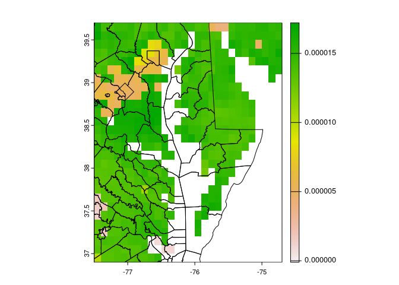

# Team Micro-Emissions FIRE Summit Presentation

## Research Question

How does emissions from battery recycling plants impact water pollution
in the Chesapeake Bay?


## Data Wrangling

Outcome Variable

We obtained our outcome variable from
<https://datahub.chesapeakebay.net/> where water quality at each county
adjacent to the Chesapeake Bay is recorded each day.

``` r
library("tidyverse")
library("simplermarkdown")

#open file and select important parameters
out<-read.csv("WaterQualityFIPS.csv") %>%
  select(FIPS, SampleDate, Parameter, MeasureValue, Unit) 

md_table(head(out))
```

    |FIPS |SampleDate|Parameter|MeasureValue|Unit|
    |-----|----------|---------|------------|----|
    |11001|9/29/2016 |TN       |1.562       |MG/L|
    |11001|7/27/2016 |TN       |0.939       |MG/L|
    |11001|7/29/2016 |TN       |1.437       |MG/L|
    |11001|8/16/2016 |TN       |1.326       |MG/L|
    |11001|8/24/2016 |TN       |0.870       |MG/L|
    |11001|9/8/2016  |TN       |1.140       |MG/L|

Control Variable

To take into account precipitation and stormwater runoff, we used NASA
Landsat data which provide monthly averages for every 0.1 longitude and
0.1 latitude grids.

Average evapotranspiration levels from January 2010 is shown below.

``` r
library("terra")

cmd<-vect("Shapefiles/tl_2020_24_county10.shp")
cva<-vect("Shapefiles/tl_2020_51_county10.shp")

r<-rast("201001.nc4")
rp<-project(r[[1]], crs(cmd))

plot(rp)
plot(cmd, add=TRUE)
plot(cva, add=TRUE)
```


We then find the average evapotranspirtation, precipitation, and
stormwater runoff for each county and each month.

## Preliminary Results

After combining all the data together, here is a summary of our outcome
variable (Total Column Tropospheric NO2) before and after the opening of
factories.

``` r
df<-read.csv("nasa_no2.csv")

open1<-as.Date("20220101", format='%Y%m%d')
open2<-as.Date("20220501", format='%Y%m%d')
open3<-as.Date("20221001", format='%Y%m%d')

df2<-df %>%
  filter(!is.na(NO2)) %>%
  filter(ID<=3) %>%
  mutate(date=paste0(substr(Filename,6,9), substr(Filename, 11,14))) %>%
  mutate(date=as.Date(date, format='%Y%m%d')) %>%
  mutate(PrePost=ifelse(ID==1 & date<open1, "Before", "After")) %>%
  mutate(PrePost=ifelse(ID==2 & date<open2, "Before", PrePost)) %>%
  mutate(PrePost=ifelse(ID==3 & date<open3, "Before", PrePost))

ggplot(data=df2, aes(x=date, y=NO2, color=PrePost, shape=factor(ID)))+
  geom_point()+
  theme_bw()+
  xlab("Year")+
  ylab("Total Column Troposheric NO2")+
  labs(shape = "Factory ID", colour = "Opening Status")
```



Below is the average Total Column Tropospheric NO2 levels within a 10 km
radius around three factories before and after their openings.

``` r
Before<-df2 %>%
  filter(PrePost=="Before") %>%
  group_by(ID) %>%
  summarize(MeanBefore = mean(NO2)/10e14, SDBefore = sd(NO2)/10e14)

After<-df2 %>%
  filter(PrePost=="After") %>%
  group_by(ID) %>%
  summarize(MeanAfter = mean(NO2)/10e14, SDAfter = sd(NO2)/10e14)

summ<-merge(Before, After, by="ID") 

md_table(summ, digits=2)
```

    |ID|MeanBefore|SDBefore |MeanAfter|SDAfter  |
    |--|----------|---------|---------|---------|
    |1 |2.446468  |1.9467513|2.093651 |2.0200790|
    |2 |2.337873  |0.9223341|2.088327 |0.8778855|
    |3 |1.690165  |1.0241428|1.768923 |1.0620468|
