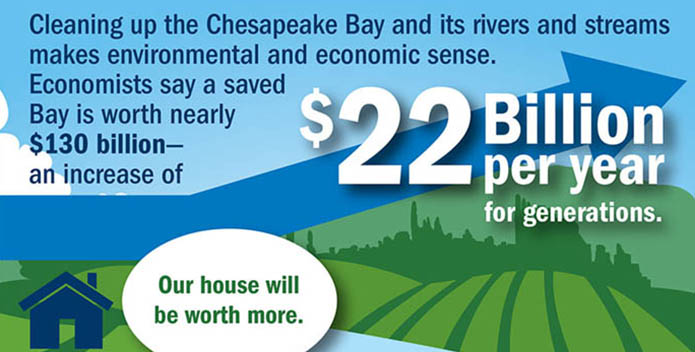

# Team Micro-Emissions FIRE Summit Presentation

*Thanicha Ruangmas*

## Research Question

How does emissions from battery recycling plants impact water pollution in the Chesapeake Bay?

## Background

{width="500"}

This research has not been conducted before by anyone.

## Data Wrangling

We obtained our outcome variable from <https://datahub.chesapeakebay.net/> where water quality at each county adjacent to the Chesapeake Bay is recorded each day.

```{r}
out<-read.csv("WaterQualityFIPS.csv")
```

`{knitr::kable(out)}`

You can display your codes without making it run by adding **#\| eval: false** at the top of the chunk.

You can also suppress warnings by adding **#\| warning: false**.

```{r}
#| eval: false
#| warning: false

```

## Preliminary Results

If your team has created a data frame, please summarize the data in the form of a table and a graph in this section.
